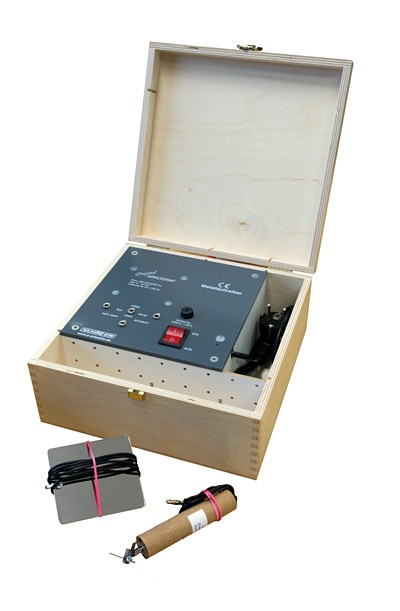
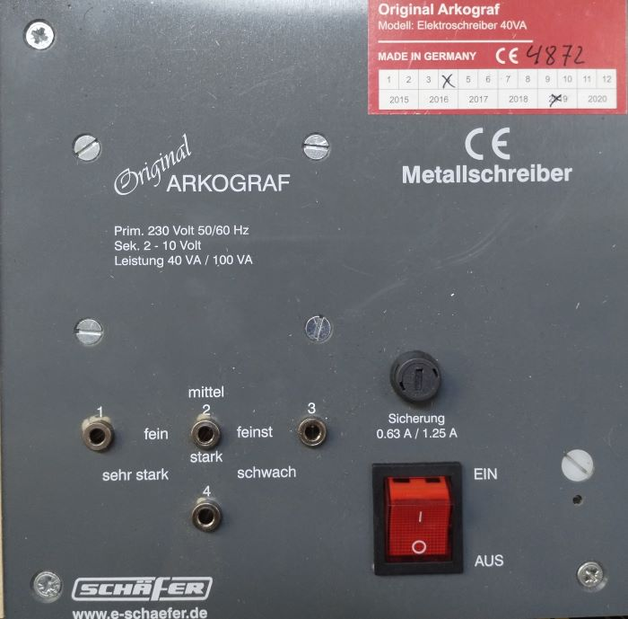
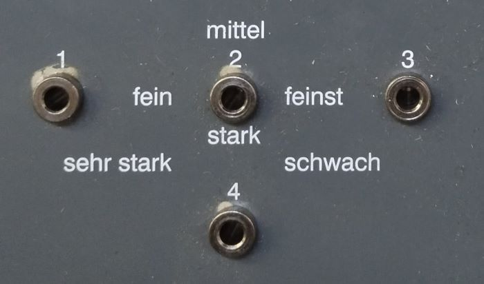

# Инструкция по эксплуатации электрической гравировальной машины типа Arkograf 70040

## Общие указания

В целях безопасности, а также в целях безопасности рабочей среды соблюдайте инструкции по технике безопасности.  Инструкции предупреждают о возможной опасности.

## Правила техники безопасности

Соблюдайте соответствующие инструкции по охране труда и правила техники безопасности. Опасность поражения электрическим током! Прибор Arkograf не используется во влажных помещениях! __Опасность повреждения сетчатки глаза!__ При работе с маркировочной ручкой надевайте защитные очки для защиты глаз.

## Технические характеристики

- Рабочее напряжение 230 В переменного тока, 50 или 60 Гц
- Предохранитель 0,63 А
- Трансформатор VDE 0550 или 0551
- Потребляемая мощность 800 Вт
- Рабочее напряжение 2-10 В переменного тока после включения
- Пишущие электроды диаметром 1,2 мм и 1,5 мм
- Допустимое время непрерывной работы - 4 минуты

## Назначение

Электрическая гравировальная машина типа 70040 предназначена для маркировки металлических деталей с помощью маркировочной ручки.

## Комплектность

Тип 70040 - 1 пишущий стилус по металлу, 1 заземляющая пластина, 3 вольфрамовых электрода, инструкция по эксплуатации, деревянная коробка.

## Внешний вид машины типа 70040

## При работе с маркировочной ручкой

- Cоблюдайте инструкции по технике безопасности.
- Маркировочная ручка не пишет по ржавчине и трухе. Для достижения разборчивости текста заточите пишущие электроды заново.
- Вставьте пишущий электрод в ручку и затяните винт.
- Подключите маркировочную ручку в разъемы. При работе используйте только разъемы 2+3 или 3+4.
- Вольфрамовые электроды после работы с ручкой будут сильно нагреваться!

|Номера контактов|Качество письма|Обозначение контактов на приборе|
|---|---|---|
|3+4|Слабо|schwach|
|1+2|Хорошо|fein|
|2+3|Очень хорошо|feinst|
|1+3|Средний|mittel|
|2+4|Сильный|stark|
|1+4|Очень сильный|sehr stark|

- Вставьте вилку сетевого шнура в розетку с герметичными контактами.
- Плотно закрепите материал на противоположном полюсе.
- Включите сетевой выключатель, загорится контрольная лампа.
- Начинайте писать. Держите маркировочную ручку в руке вертикально на обрабатываемом материале.
- После окончания работы положите пишущую ручку в безопасное место.
- Опасность обжечься!
- Выключите сетевой выключатель и выньте вилку из розетки с герметичным контактом.

## Поддержка

Прибор Arkograf не требует технического обслуживания.Изношенные электроды можно заточить заново.
Электроды можно приобрести у ваших дилеров.
Производитель: <https://e-schaefer.de/index.html>
